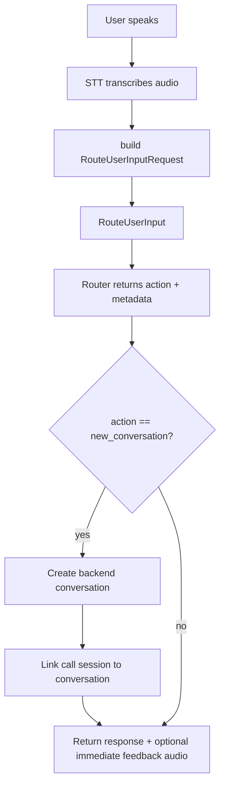
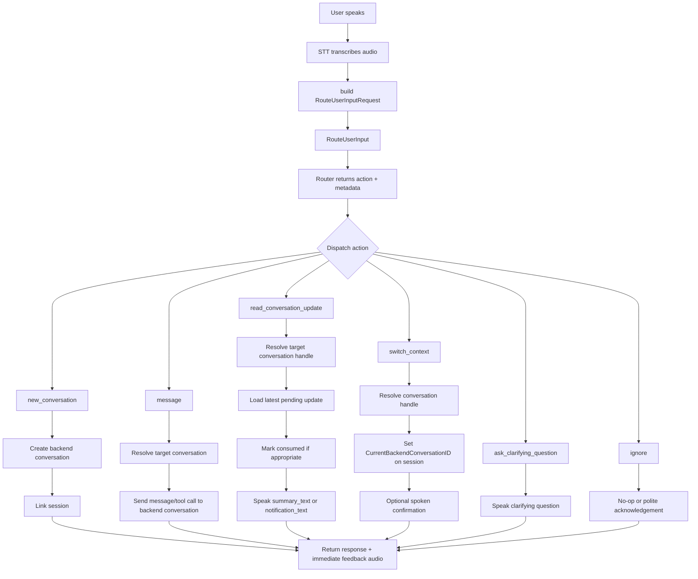
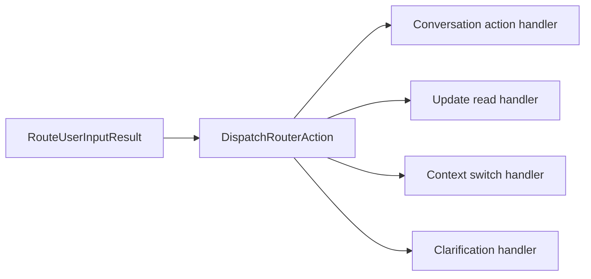

# Router Flow

This document describes how user input routing should work in `tincan-server`, what state it depends on, and which action handlers are still missing.

## Problem

Today the router can return actions such as:

- `new_conversation`
- `message`
- `read_conversation_update`
- `switch_context`
- `ask_clarifying_question`
- `ignore`

But the server currently only executes `new_conversation` after routing. The other actions are classified by the router and logged, but no server-side action handler runs for them yet.

That means a transcript like:

- "read the latest update from emma#9"

can produce:

- `action=read_conversation_update`
- `conversation_handle="emma#9"`

without actually reading or speaking the update back to the user.

## Current Runtime Flow



## Desired Runtime Flow



## State Model

The routing layer depends on two kinds of state.

### Durable state

Stored in the database:

- conversations
- conversation notes
- pending conversation updates

This state survives server restarts.

### Ephemeral call-session state

Stored in `calls.Manager`:

- active transport session
- linked backend conversation IDs
- current backend conversation ID
- event sink / live connection state

This state is in-memory only and is reset if the server restarts or the call session ends.

## State Needed By Routing

The router request should be built from:

- `Transcript`
- `ConversationHandles`
- `CurrentConversationHandle`
- `CurrentConversationNotes`
- `PendingUpdateHandles`

That gives the LLM enough context to classify intent, but classification alone is not enough. The server must also have deterministic action handlers after routing.

## Action Semantics

### `new_conversation`

Meaning:

- create a new backend conversation using the chosen agent profile
- optionally seed it with an initial user request

Current status:

- implemented

### `message`

Meaning:

- send a follow-up request to the current conversation
- or to a conversation resolved from `conversation_handle`

Expected execution:

- resolve target conversation
- send message to the agent backend
- optionally update current session context

Current status:

- router may return it
- server-side execution missing

### `read_conversation_update`

Meaning:

- read the latest pending update for a conversation
- usually from `conversation_handle`, or fall back to current conversation

Expected execution:

- resolve target conversation
- load latest pending update
- speak `summary_text`
- optionally mark the update consumed

Current status:

- router may return it
- server-side execution missing

This is the gap shown by the log line:

```text
router action: read_conversation_update agent_profile="emma" handle="emma#9"
```

The router did its job. The post-routing dispatcher did not.

### `switch_context`

Meaning:

- switch the session's current conversation to another existing handle

Expected execution:

- resolve the conversation by handle
- set `CurrentBackendConversationID` in `calls.Manager`
- confirm to the user if helpful

Current status:

- router may return it
- server-side execution missing

### `ask_clarifying_question`

Meaning:

- the router could not safely decide

Expected execution:

- synthesize and speak `immediate_feedback` or `message`

Current status:

- partial
- spoken feedback exists, but there is no explicit structured handler

### `ignore`

Meaning:

- no action should be taken

Expected execution:

- do nothing, or give a brief acknowledgement if needed

Current status:

- implicit only

## Recommended Server Boundary

The router should not directly cause backend side effects. It should only classify and produce a structured result.

After that, the server should run an explicit action dispatcher:



This keeps the boundary clear:

- router = intent classification
- dispatcher = action selection
- handlers = concrete side effects

## Recommendation

Implement a dedicated post-routing dispatcher in `tincan-server/main.go` or extract it into a small service.

Suggested first slices:

1. `read_conversation_update`
2. `switch_context`
3. `message`

Those are the minimum required to make conversation state feel real instead of only supporting new session creation.
